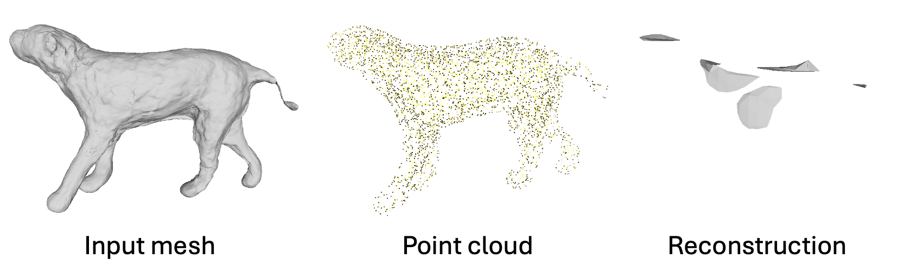
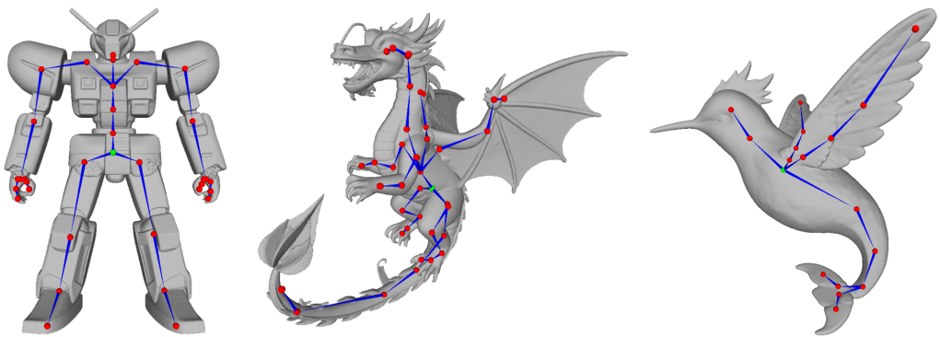

# Auto-regressive Skeleton Generation
This folder provides the skeleton generation implementation and scripts to evaluate the paper’s metrics on three test sets. You can also run inference on your own 3D objects.

## Weights Download
First download [checkpoints of Michelangelo](https://huggingface.co/Maikou/Michelangelo/tree/main/checkpoints/aligned_shape_latents) and our [released weights](https://huggingface.co/Seed3D/Puppeteer) for skeleton generation:

```
python download.py
```

## Evaluation

To reproduce our evaluations, run the following command on `Articulation-XL2.0-test`, `ModelsResource-test` and `Diverse-pose-test`. `Articulation-XL2.0-test` and `Diverse-pose-test` are available [here](https://huggingface.co/datasets/chaoyue7/Articulation-XL2.0). For your convenience, we also save `ModelsResource-test` in our format (download it [here](https://drive.google.com/file/d/12U2ZuZWcKCQRI3IheBbG6I9-jfpG4KF5/view?usp=sharing)). The inference process requires 4.6 GB of VRAM and takes 1–2 seconds per inference.

```
bash eval.sh
```
You can change `save_name` for different evaluation and check the quantitative results afterwards in `evaluate_results.txt`. The pipeline saves mesh and skeleton as `.obj` files; pass `--save_render` to additionally generate rendered previews of the mesh and skeleton.

These are the numbers (the metrics are in units of 10−2) that you should be able to reproduce using the released weights and the current version of the codebase.
<table>
  <thead>
    <tr>
      <th rowspan="2">Test set</th>
      <th colspan="3">Articulation-XL2.0-test</th>
      <th colspan="3">ModelsResource-test</th>
      <th colspan="3">Diverse-pose-test</th>
    </tr>
    <tr>
      <th>CD-J2J</th>
      <th>CD-J2B</th>
      <th>CD-B2B</th>
      <th>CD-J2J</th>
      <th>CD-J2B</th>
      <th>CD-B2B</th>
      <th>CD-J2J</th>
      <th>CD-J2B</th>
      <th>CD-B2B</th>
    </tr>
  </thead>
  <tbody>
    <tr>
      <td>train on Arti-XL2.0 w/o diverse-pose subset</td>
      <td>3.062</td>   
      <td>2.342</td>         
      <td>1.963</td>        
      <td>3.843</td>  
      <td>2.876</td>      
      <td>2.465</td>       
      <td>3.276</td>  
      <td>2.597</td>     
      <td>2.074</td>       
    </tr>
    <tr>
      <td>train on Arti-XL2.0 w/ diverse-pose subset</td>
      <td><b>3.047</b></td> 
      <td><b>2.337</b></td>  
      <td><b>1.952</b></td>   
      <td><b>3.785</b></td>  
      <td><b>2.847</b></td>   
      <td><b>2.430</b></td>    
      <td><b>2.483</b></td>      
      <td><b>1.922</b></td>    
      <td><b>1.600</b></td>   
    </tr>
  </tbody>
</table>

Note: If your results differ from the reported numbers in the table above (e.g., 3.78-->～3.90 for CD-J2J on ModelsResource), check the version of `transformers` which may cause the following warnings:
```
Flash Attention 2.0 only supports torch.float16 and torch.bfloat16 dtypes, but the current dype in SkeletonOPTModel is torch.float32. You should run training or inference using Automatic Mixed-Precision via the with torch.autocast(device_type='torch_device'): decorator, or load the model with the torch_dtype argument. Example: model = AutoModel.from_pretrained("openai/whisper-tiny", attn_implementation="flash_attention_2", torch_dtype=torch.float16)
Flash Attention 2.0 only supports torch.float16 and torch.bfloat16 dtypes, but the current dype in SkeletonOPTDecoder is torch.float32. You should run training or inference using Automatic Mixed-Precision via the with torch.autocast(device_type='torch_device'): decorator, or load the model with the torch_dtype argument. Example: model = AutoModel.from_pretrained("openai/whisper-tiny", attn_implementation="flash_attention_2", torch_dtype=torch.float16)
```
These results were obtained using `CUDA 11.8`. We observed that switching to CUDA 12.1 or other versions, while keeping all package versions identical, resulted in slight numerical variations.

## Demo
We provide some examples (download [here](https://drive.google.com/file/d/1bjtA3JSqW-t0YoSd2vOZy3iKvuOMLIrm/view?usp=sharing)) to test our models by running the following command. You can also test our models on your 3D objects, remeber to change the `input_dir`.
```
bash demo.sh
```

Input mesh quality directly affects model performance, since the pre-trained shape encoder was trained on high-quality meshes. You can test reconstruction using the shape latents extracted from the shape encoder to check your data. The example below shows results from an input mesh with coarse surface.

<p align="center">
  
</p>

## Visualization
We use MeshLab for skeleton visualization in paper. The skeleton can be saved using `save_skeleton_obj` in `utils/save_utils.py`. Bones are represented as blue cones oriented from the parent joint to the child joint, joints as red spheres, and the root joint as a green sphere. Example results are shown below.

<p align="center">
  
</p>