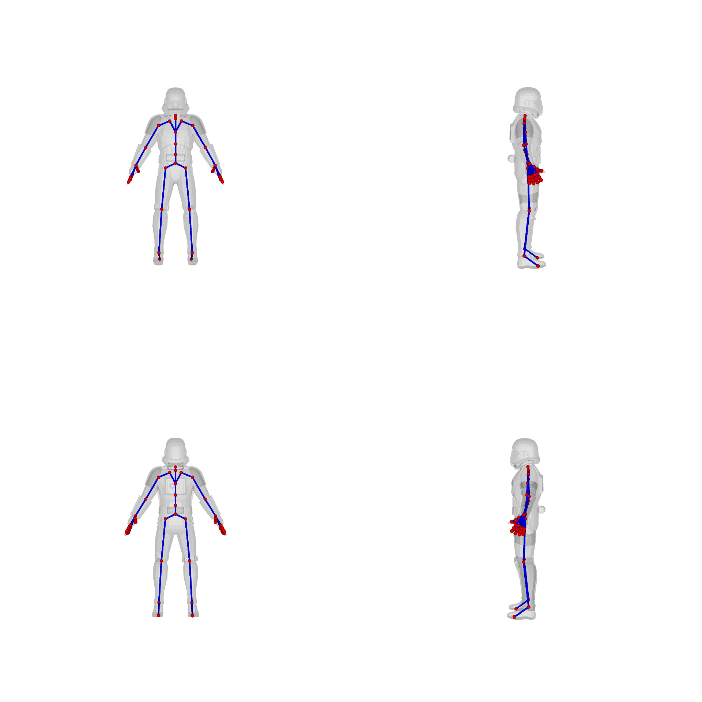

## Preprocessed data
We provide the preprocessed data that saved in NPZ files, which contain the following information:
```
'vertices', 'faces', 'normals', 'joints', 'bones', 'root_index', 'uuid', 'pc_w_norm', 'joint_names', 'skinning_weights_value', 'skinning_weights_rows', 'skinning_weights_cols', 'skinning_weights_shape'
```
You can check `read_npz.py` for how to read the NPZ files and `save_npz.py` for how we save them.

Before saving them into NPZ files, we extract mesh(.obj) and rig(.txt) from downloaded 3D models from Objaverse-XL using Blender. The rig file follows the format in [RigNet](https://github.com/zhan-xu/RigNet), which includes the following entries:
```
joints [joint_name] [x] [y] [z]
root [root_joint_name]
skin [vertex_index] [joints_name1] [skinning_weight1] [joints_name2] [skinning_weight2] ...
hier [parent_joint_name] [child_joint_name]
```
For an example, please see `examples/0a59c5ffa4a1476bac6d540b79947f31.txt`.

If you want to convert NPZ file back to OBJ and TXT files, we give an example by running:
```
python convert_npz_to_mesh_rig.py
```

## Visualization
We provide a method for visualizing 3D models with skeleton using [Pyrender](https://github.com/mmatl/pyrender), modified from [Lab4D](https://github.com/lab4d-org/lab4d/tree/ppr/). This visualization also serves as input to the VLM for skeleton quality rating. Make sure you have installed the following packages before running visualization:
```
pip install trimesh opencv-python pyrender
```

We provide an example to demonstrate the process. For this example, we prepare an OBJ file along with a TXT file containing rigging information. Then, run:
```
python render_data.py
```
You will obtain the following outputs:

<p align="center">
  
</p>

### Reading rig and mesh from GLBs
We provide the script we use for reading rig (.txt) and mesh (.obj) from glb files. You can run:
```
python read_rig_mesh_from_glb.py
```
Remember to download Blender (we use 4.2.0) and also bpy in your conda environment.
